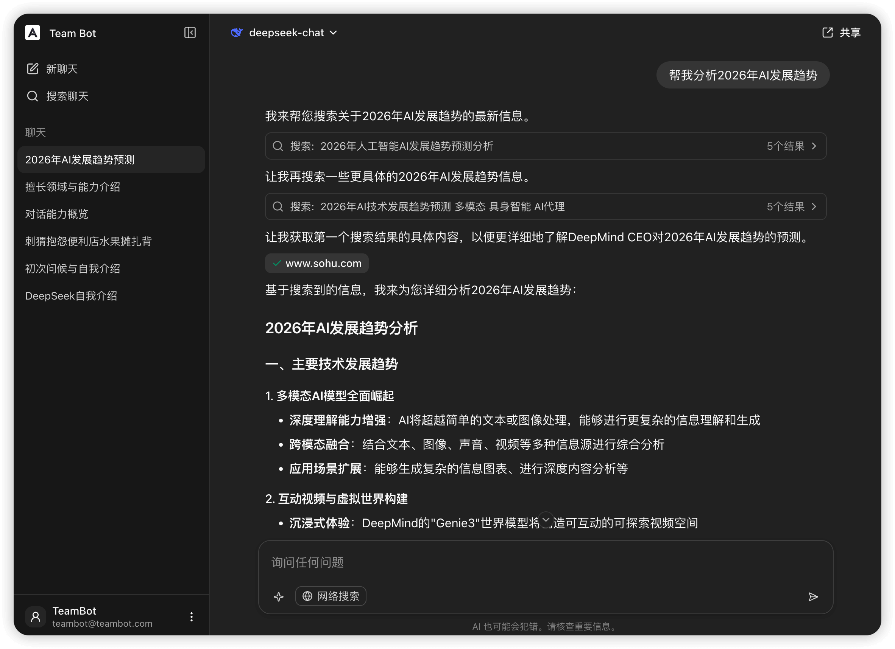
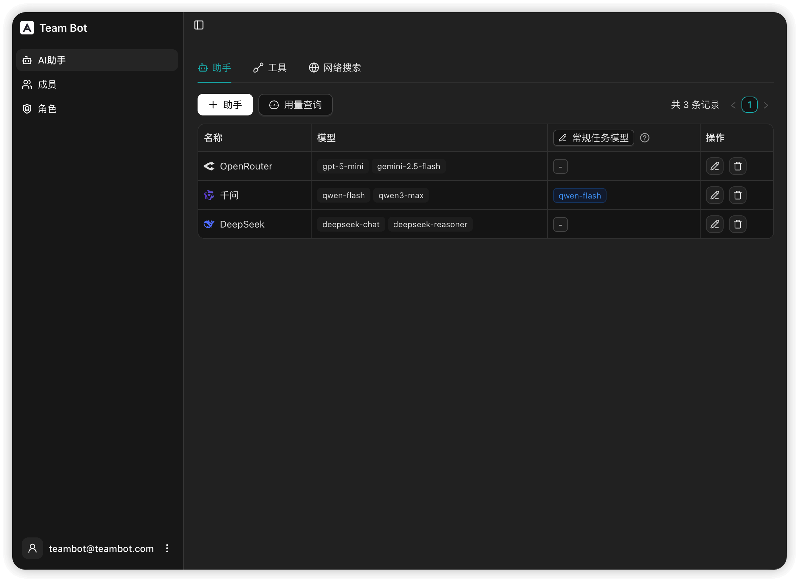
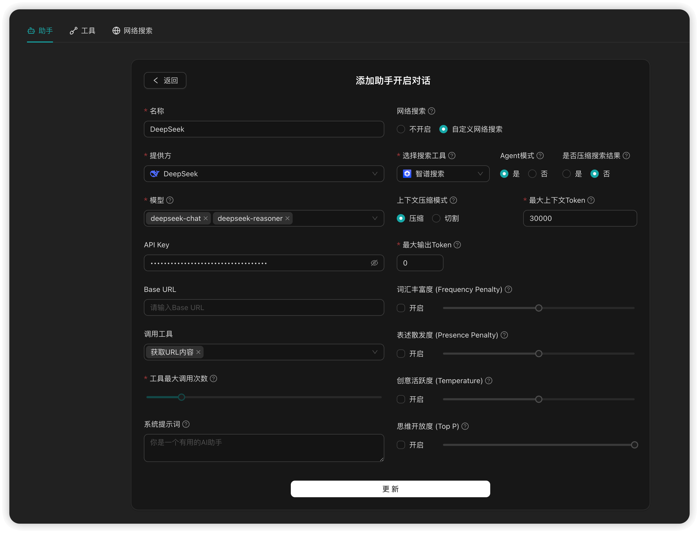

# 🤖 TeamBot — 基于团队的大模型对话平台

> **让团队高效、安全地使用大模型，并自定义扩展。**  
> 💡 当前状态：**预览版（Preview）**

---

## 🌟 什么是 TeamBot？

TeamBot 是一款专为团队打造的统一 AI 对话平台。通过集中管理多模型 API 密钥，提供安全、简洁、可扩展的协作界面，让团队成员无需关心底层配置，专注使用 AI 提升效率。

---

## ✨ 核心特性

| 功能                         | 描述                                                                         | 优势                     |
| ---------------------------- | ---------------------------------------------------------------------------- | ------------------------ |
| **🌐 多模型统一接入**        | 支持 OpenAI、Qwen、DeepSeek、Gemini、Zhipu、DouBao、OpenRouter、Anthropic 等 | 无需切换平台，统一入口   |
| **🔒 团队安全管控**          | 后台集中管理密钥，加密存储；基于助手/时间的 Token 统计                       | 防止密钥泄露，合规可控   |
| **🧠 智能搜索 + Agent 模式** | 内置或自定义搜索引擎；支持 Agent 自主多轮检索                                | 更适合研究型、探索型任务 |
| **🔐 SSO 集成**              | 支持企业单点登录（OAuth 2.0）                                                | 接现有身份系统           |

---

### 📷 图片预览







### 🌐 多模型统一管理

- 所有模型在一个界面中自由切换
- 已支持：

  - **OpenAI**
  - **Qwen（通义千问）**
  - **DeepSeek**
  - **Gemini**
  - **Zhipu（智谱）**
  - **DouBao（豆包）**
  - **OpenRouter**
  - **Anthropic**

### 🔒 安全与权限

- **API Key 由管理员统一配置**，加密存储，成员不可见
- **细粒度权限控制**：按角色分配模型访问权限
- **Token 使用统计**：按助手、时间段查询
- **SSO 支持**：快速集成已有认证体系

### 🧠 智能搜索 & Agent 模式

- **内置搜索**：OpenAI、Qwen、Zhipu、Gemini、OpenRouter 等原生支持
- **自定义搜索源**：智普、博查、Google、Tavily、Exa 等
- **Agent 模式**（需要自定义搜索源）：模型自动调用搜索 → 多轮分析 → 输出结构化答案

  > 📌 示例：提问 “2026 年 AI 发展趋势”，Agent 会主动检索最新资料并综合回答

- 自定义 http 调用工具，用于获取其他关键信息。

---

## 🚀 路线图（Roadmap）

| 功能                     | 状态      | 预计上线   | 价值                                                                  |
| ------------------------ | --------- | ---------- | --------------------------------------------------------------------- |
| **自定义 MCP 插件接入**  | 🛠️ 开发中 | 2026 Q1    | 支持灵活扩展，团队内部 API 接入                                       |
| **知识库问答**           | 🛠️ 开发中 | 2026 Q1    | 基于团队私有文档精准问答                                              |
| **引用本地文件夹**       | 🛠️ 开发中 | 2026 Q1    | 基于 Chrome 文件系统对本地文件夹中的<br/>文件进行快捷引用，和索引对话 |
| **多模态对话**           | 🛠️ 开发中 | 2026 Q1    | 支持图像、音频等输入输出                                              |
| **移动端适配，PWA 模式** | 🛠️ 开发中 | 2026 Q1    | 响应式设计，兼容移动端，支持浏览器一键安装为 App                      |
| **内置 Function Call**   | 📅 计划中 | 2026 Q2-Q3 | 自动生成图表、PPT、代码等                                             |
| **定时任务**             | 📅 计划中 | 2026 Q2–Q3 | 自动执行 agent 任务，邮件通知                                         |

---

## 🌐 在线体验

访问演示站点，通过 GitHub 登录 🔗 [TeamBot Demo](https://demo.teambot.cc/)

---

## 🐳 快速部署（Docker）

```bash
## 目前处于Preview版， 需要修改.env文件 APP_VERSION=v0.1.0-beta15。
mkdir teambot
cd teambot
curl -sSL https://raw.githubusercontent.com/YuanMeta/teambot/main/docker/install.sh | bash
docker compose pull
docker compose up -d --pull always
```

> ⚠️ 注意：若 `install.sh` 返回 404，请确认仓库路径是否正确，或手动下载 `docker-compose.yml`。

---

## 🛠️ Nginx 反向代理配置

```nginx
upstream app {
    server localhost:3015;
}

server {
    listen      443 ssl;
    server_name teambot.cc *.teambot.cc;

    ssl_certificate     /etc/ssl/teambot/fullchain.pem;
    ssl_certificate_key /etc/ssl/teambot/teambot.key;
    ssl_protocols       TLSv1.2 TLSv1.3;
    ssl_prefer_server_ciphers off;

    proxy_set_header X-Real-IP $remote_addr;
    proxy_set_header X-Forwarded-For $proxy_add_x_forwarded_for;
    proxy_set_header Host $http_host;
    proxy_http_version 1.1;

    location / {
        proxy_pass http://app;
    }

    location /stream/ {
        proxy_buffering off;
        proxy_cache off;
        gzip off;
        proxy_read_timeout 86400s;
        proxy_pass http://app;
    }
}
```

---

### 🤝 反馈

TeamBot 正在快速发展中，欢迎：

- 🐞 提交 Issue
- 💡 提出新功能建议
- 🌍 分享你的使用场景
